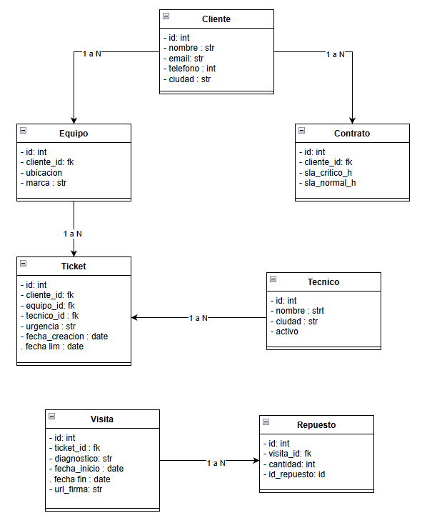

### **3.1 Levantamiento: Preguntas clave**
1. ¿Cuál es exactamente la definición de horario hábil para la empresa?

Por qué cambia el diseño: Si el horario es de L-V de 8 a 5 p.m, el algoritmo que calcula la fecha de vencimiento del SLA no es una simple suma de horas, sino que debe saltar noches, fines de semana y festivos

2. ¿El inventario de repuestos se debe descontar en Odoo en tiempo real o al final del día?

Por qué cambia el diseño: Si es en tiempo real, la app móvil dependerá de conectividad para validar disponibilidad, requiriendo un manejo de errores complejo.

3. ¿Un mismo cliente puede tener diferentes tiempos de SLA dependiendo del equipo o sucursal?

Por qué cambia el diseño: Si el SLA varía por equipo, la regla de negocio del SLA debe vivir en la entidad Equipo y no en Cliente o Contrato general.

### **3.2 Actores e historias de usuario**

**Actores identificados:** Cliente, Coordinador, Técnico en campo, Gerente.

**HU01:** Como Cliente, quiero reportar una falla indicando el equipo afectado y su nivel de urgencia, para generar una solicitud formal de servicio.

**HU02:** Como Coordinador, quiero ver una lista de tickets ordenados por tiempo restante de SLA, para asignar rápidamente al técnico disponible.

**HU03:** Como Técnico, quiero registrar el diagnóstico, fotos, repuestos y la firma del cliente en mi aplicación, para documentar y cerrar el servicio en el sitio.

**HU04:** Como Cliente, quiero recibir notificaciones cuando mi reporte cambie de estado (asignado, en camino, resuelto), para no tener que llamar a preguntar.

- **Criterios de Aceptación:**

Para **HU01:**

- Dado un cliente autenticado en el portal web.

- Cuando selecciona un equipo, elige la urgencia "Crítica" y envía el formulario.

- Entonces el sistema crea un ticket en estado "Abierto", calcula el vencimiento en 4 horas hábiles y lo muestra en el panel del coordinador.

Para **HU03:**

- Dado un técnico que ha finalizado el trabajo físico.

- Cuando ingresa los repuestos usados, adjunta 1 foto y el cliente firma en la pantalla.

- Entonces el sistema cambia el estado del ticket a "Resuelto" y bloquea la edición de la visita.

### **3.3 Modelo de datos**

### **3.4 Arquitectura de alto nivel**

Monolito

### **3.5 Alcance (MVP y Riesgos)**
Incluye: Portal web para que el cliente cree tickets, panel del coordinador para asignar manualmente y visualizar el semáforo del SLA, app móvil con modo offline básico que permite ver el ticket asignado, anotar el diagnóstico, tomar fotos y recoger firma. Sincronización manual de repuestos (el técnico escribe el nombre).

Queda por fuera: Sincronización en tiempo real del inventario, ruteo automático por mapas, notificaciones por WhatsApp , y dashboards gerenciales 

Riesgo: Resistencia al cambio por parte de los técnicos.

Mitigación: Diseñar una interfaz móvil con botones grandes y acompañar el lanzamiento con capacitación presencial y soporte la primera semana de salida a producción.